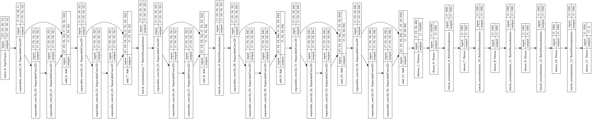

# [INGV - Volcanic Eruption Time](https://www.kaggle.com/c/predict-volcanic-eruptions-ingv-oe) Competition

## Context

What if scientists could anticipate volcanic eruptions as they predict the weather? While determining rain or shine days in advance is more difficult, weather reports become more accurate on shorter time scales. A similar approach with volcanoes could make a big impact. Just one unforeseen eruption can result in tens of thousands of lives lost. If scientists could reliably predict when a volcano will next erupt, evacuations could be more timely and the damage mitigated.

Currently, scientists often identify “time to eruption” by surveying volcanic tremors from seismic signals. In some volcanoes, this intensifies as volcanoes awaken and prepare to erupt. Unfortunately, patterns of seismicity are difficult to interpret. In very active volcanoes, current approaches predict eruptions some minutes in advance, but they usually fail at longer-term predictions.

Enter Italy's Istituto Nazionale di Geofisica e Vulcanologia (INGV), with its focus on geophysics and volcanology. The INGV's main objective is to contribute to the understanding of the Earth's system while mitigating the associated risks. Tasked with the 24-hour monitoring of seismicity and active volcano activity across the country, the INGV seeks to find the earliest detectable precursors that provide information about the timing of future volcanic eruptions.

## Competition Description

Participants are to predict when a volcano's next eruption will occur. A large geophysical dataset collected by sensors deployed on active volcanoes has been provided. If successful, your algorithms will identify signatures in seismic waveforms that characterize the development of an eruption.

With enough notice, areas around a volcano can be safely evacuated prior to their destruction. Seismic activity is a good indicator of an impending eruption, but earlier precursors must be identified to improve longer-term predictability. The impact of your participation could be felt worldwide with tens of thousands of lives saved by more predictable volcanic ruptures and earlier evacuations.


# Data Preprocessing

Before processing the data, we should note some details about the data:
- Data is normalized.
- Data is collected via <u>10</u> seismic sensors around a volcano.
- There are 6000 entries per sensor
- 4431 Training files and 4520 Testing files
- Each training data is a dataframe with 10 columns (per sensor) and 6000 entries for each sensor

## Strategies

- Dimension reduction will not be useful since the data is a series of continuos signals.
- Missing values should be imputed with zero since it just means that there are no signals detected. Anything other than zero will cause noise in data.
- Training and testing dataframes are located in their own folders (Train and Test). The name of each dataframe has the same id as in the train.csv (where the eruption time has been given) and sample submission (where we predict the results and submit), thus:

    ```python
    # Getting the ids
    train_ids = train['segment_id']
    test_ids = sample_submission['segment_id']
    ```

### Statistical Attributes
- In order to gain some insight from the signal and feed it to an algorithm, we have to take the statistical Attributes (measures of central tendency) for each dataframe:
    - min, max
    - std, mean, mad, skew, Kurtosis
    - quantiles: 1, 5, 10, 20, 25, 40, 50, 65, 75, 80, 85, 90, 95, 99
    - IQR, OMax: Q1 - 1.5 IQR, OMin :Q3 + 1.5IQR

    ```python
    def extract_features(col):
        """
            Returns a one row DataFrame of features for a signal signal.
            
            input:
                col: the column (signal) used for feature
                    extraction.
                
            return:
                pd.DataFrame object containing the data of 
                the signal.
        """
        features = {} # Features dictionary
        # Measure of central tendency
        features['max'] = col.max()
        features['min'] = col.min()
        features['std'] = col.std()
        features['mean'] = col.mean()
        features['mad'] = col.mad()
        features['skew'] = col.skew()
        features['kurtosis'] = col.kurtosis()
        
        # Quantiles
        features['q-01'] = np.quantile(col, 0.01)
        features['q-05'] = np.quantile(col, 0.05)
        features['q-10'] = np.quantile(col, 0.1)
        features['q-25'] = np.quantile(col, 0.25)
        features['q-50'] = np.quantile(col, 0.5)
        features['q-75'] = np.quantile(col, 0.75)
        features['q-90'] = np.quantile(col, 0.90)
        features['q-95'] = np.quantile(col, 0.95)
        features['q-99'] = np.quantile(col, 0.99)
        
        return pd.DataFrame(features, index=range(1))
    ```

- In order to further automate the code, ***process_data*** function was written to take the volcano ids and base_path. Then process the signal data based on the measures of central tendency. The processed data is saved as multi-dimensional and save in a <a href="https://www.kaggle.com/damoonshahhosseini/volcano-pca">Kaggle dataset</a> to be used for different modelling approaches.

    ```python
    def process_data(ids, file_name, base_path):
        data = np.empty(shape=(len(ids),10,16))

        for index, Id in enumerate(ids):
            df = pd.read_csv(f'{base_path}{Id}.csv').fillna(0)
            data[index] = reduce_data(df)
        
        # save the data
        np.save(f'{file_name}.npy', data)
    ```

## Rolling Data

Since we are dealing with signal data another approach will be to see if there are any patterns within the chunks of data. In other words using rolling data to break data into smaller chunks and record the change of its measures (mean, std, etc.) can help to make accurate prediction.

- This function gets the mean, std, skew,residual of the rolling data

    ```python
    def extract_rolling_features(rolling_data, rolling_type):
        """
            Gets the measures of central tendency for the rolling data.
            
            input:
                rolling_data
                rolling_type: mean / std / skew / residual of a rolling data
            
            return: 
                dataframe containing the measures of central tendency
        """
        return pd.concat(
            {
                f'{rolling_type}_mean': rolling_data.mean(), 
                f'{rolling_type}_std': rolling_data.std(), 
                f'{rolling_type}_skew': rolling_data.skew(), 
                f'{rolling_type}_residual': rolling_data.max() - rolling_data.min()
            }, axis=1)
    ```
- A window size of 300 is used to process data on a rolling basis. 
- The mean, std, skew, residual for each of these periods have been measured and passed to the function above for further extraction.

    ```python
    def rolling_analysis(data):
    """
        Gets the measures of central tendency on the rolling data
        
        input:
            data: Given data
        
        return:
            dataframe containing the features for the measures of central 
            tendency for the rolling data
    """
    # Getting the rolling data
    indexer = pd.api.indexers.FixedForwardWindowIndexer(window_size=300) 
    # Instantiating the indexer object
    rolling_data = data.rolling(window=indexer, min_periods=1)
    
    # measures of central tendency for the rolling data
    rolling_mean = rolling_data.mean() # Rolling averages
    rolling_std = rolling_data.std() # Rolling std
    rolling_skew = rolling_data.skew() # Rolling skew
    rolling_residual = rolling_data.max() - rolling_data.min() # Rolling residual values
    
    # Extracting their features
    mean_feats = extract_rolling_features(rolling_mean, 'rmean')
    std_feats = extract_rolling_features(rolling_std, 'rstd')
    skew_feats = extract_rolling_features(rolling_skew, 'rskew')
    residual_feats = extract_rolling_features(rolling_residual, 'rres')
    
    return pd.concat([mean_feats, std_feats, skew_feats, residual_feats], axis=1).fillna(0)
    ```
- As a means to automation, a process_data function is written for rolling_data as well 
    ```python
    def process_rolling_data(ids, file_name, base_path):
        data = np.empty(shape=(len(ids),10,16))

        for index, Id in enumerate(ids):
            df = pd.read_csv(f'{base_path}{Id}.csv').fillna(0)
            data[index] = rolling_analysis(df)
        
        # save the data
        np.save(f'{file_name}.npy', data)

    ```

## Data Augmentation

After several training session, I realized that the models might be finding some patterns with the sequence of sensors in the dataframe. I augmented the data by reordering the sensors within the dataframe:
- Five folded the training data
- Decreased the error from 9e6 to 5e6, almost halved the error


# Modeling

Neural Networks were used in this competition since the dimension of the data was relatively large even after the analysis. High scoring models were saved <a href="https://www.kaggle.com/damoonshahhosseini/volcanonn">here</a> for further improvement and ensembling. XGBoost has been used for ensembling the Neural Networks.

## Residual Connection

Inspired by the success of ResNets in Computer Vision, residual connections were used in Neural Networks to capture and sustain the previous patterns and extract even more complex patterns within the data.




## KFold Training

The goal has been to over fit the model on a chunk of data then take the average of all of those predictions via KFold splitting:

```python
def kfold_validation(model, X, y, X_test, n_rep=3, n_fold=5, batch_size=32, epochs=300, verbose=1):
    """
        Runs a repeated KFold on a given model and data
        
        input:
            model: model to train the data
            X, y, X_test: datasets needed for training and prediction
            n_rep, n_fold: parameters of Repeated KFold
            batch_size, epoch, verbose: info for the training data
        
        return:
            model: trained model
            preds: predictions at each fold
            avg_preds: average of all predictions
    """
    history, index = {}, 0  # Keep track of the loss and val_loss (history object)
    prediction = np.zeros((X_test.shape[0])) # For every single prediction
    preds = np.empty((n_rep * n_fold, X_test.shape[0])) # Saving all the predictions
    
    kf = RepeatedKFold(n_splits=n_fold, n_repeats=n_rep, random_state=288490)
    
    for train_indices, val_indices in kf.split(X, y):
    
        print(f'{index + 1}th fold, Validation Indices: ', val_indices[:5])

        # Data divided into Train and Validation splits
        X_train, X_val = X[train_indices], X[val_indices]
        X_rolling_train, X_rolling_val = X_rolling[train_indices], X_rolling[val_indices]
        y_train, y_val = y[train_indices], y[val_indices]

        # Fitting
        history[index] = model.fit(
            x=[X_train, X_rolling_train], 
            y=y_train, 
            epochs=epochs,
            batch_size=batch_size,
            validation_data=([X_val, X_rolling_val], y_val),
            verbose=verbose,
            callbacks=[ 
                ReduceLROnPlateau(
                    factor=0.96, 
                    patience=10, 
                    verbose=True, 
                    monitor='val_loss', 
                    min_lr=1e-45, 
                    min_delta=1e-4),
                EarlyStopping(
                    monitor='val_loss', 
                    patience=25, 
                    restore_best_weights=True, 
                    min_delta=1e4, 
                    verbose=True
                )
            ]
        )
        
        
        model_prediction = model.predict([X_test, X_rolling_test], 
                                         batch_size=batch_size, 
                                         verbose=False).reshape(X_test.shape[0])
        
        model_prediction = submit_prediction(model_prediction, 
                                             write=True, 
                                             file_name=f"sub{index}", 
                                             Return=True)
        
        # Saving the predictions for each fold
        preds[index] = model_prediction
        index += 1
        
        # Starting different fold or end of folding
        print('#----------------#----------------#----------------#----------------#----------------#')
        
    # Averaging the predictions
    p = pd.DataFrame(preds)
    p = p.sum() / (n_fold * n_rep)
        
    avg_pred = submit_prediction(p, 
                      write=True, 
                      file_name=f"S_avg", 
                      Return=True)
    
    return model, preds, avg_pred, history
```


# Final Prediction and Ensembling

XGBoost was used to aggregate the results of all the high scoring Neural Networks. They were two configuration used to run the XGBoost model:

## Dart Boost

- In order to avoid overfiting within the data, ***dart** booster was used
- Given the dropout feature with this booster, overfitting was reduced in the model

```python
param = {
        'booster': 'dart',
        'sample_type': 'weighted',
        'rate_drop': 0.6,
        'one_drop': 1,
        'max_depth': 20,
        'gamma': 1e4,
        'min_child_weight': 5,  
        'tree_method': 'gpu_hist',
        'objective':'reg:squarederror',
        'n_jobs':-1,
        'reg_lambda':1e-3,
        'eta':0.3,  
        'eval_metric': 'mae',
        'verbosity': 1,
        'predictor': 'gpu_predictor'
    }
```

## gbtree boost

- This one of the highest scoring boosting algorithm for regression tasks

```python
param = {
        'booster': 'gbtree',
        'max_depth': 20,
        'gamma': 1e4,
        'min_child_weight': 5,  
        'tree_method': 'gpu_hist',
        'objective':'reg:squarederror',
        'n_jobs':-1,
        'reg_lambda':1e-3,
        'eta':0.05,  
        'eval_metric': 'mae',
        'verbosity': 1,
        'predictor': 'gpu_predictor'
    }
```

# KFold Aggregation
```python
def submit_prediction(pred, write=True, file_name="", Return=True):
    """
        Submits prediction and modifies the negative values.
        
        input:
            pred: the predicted values
            write: boolean value indicating if the predictions should be
                written to a csv file.
            file_name: name of the csv file to write
            Return: if the edited predictions should be returned
        
        return:
            returns the edited predictions if asked for (Return==1)
    """
    # Replace the negative values with the mean of the data
    pred = np.where(pred < 0, np.mean(pred), pred)
    
    sample_submission['time_to_eruption'] = pred  # Formatting
    if write: sample_submission.to_csv(f'{file_name}.csv', index=False)  # Write the file to a csv file
    
    if Return: return pred
    

def kfold_validation(X, y, X_test,param, n_fold=5, seeds=[0, 1, 2, 3, 4, 5, 6]):
    """
        Runs a repeated KFold on a given model and data
        
        input:
            model: model to train the data
            X, y, X_test: datasets needed for training and prediction
            n_rep, n_fold: parameters of Repeated KFold
            param: parameters for the XGBoost model
        
        return:
            model: trained model
            preds: predictions at each fold
            avg_preds: average of all predictions
    """
    index = 0  # Keep track of the loss and val_loss (history object)
    prediction = np.zeros((X_test.shape[0])) # For every single prediction
    preds = np.empty((len(seeds) * n_fold, X_test.shape[0])) # Saving all the predictions
    dtest = xgb.DMatrix(X_test)
    
    for seed in seeds:
        kf = KFold(n_splits=n_fold, random_state=seed,shuffle=True)
        LOAD_MODEL = False
    
        for train_indices, val_indices in kf.split(X, y):
            # Data divided into Train and Validation splits
            X_train, X_val = X[train_indices, :], X[val_indices,: ]
            y_train, y_val = y[train_indices], y[val_indices]
            
            dtrain = xgb.DMatrix(X_train, label=y_train)
            dval = xgb.DMatrix(X_val, label=y_val)

            print(f'{seed}{index + 1}th fold, Validation Indices: ')
            
            if not LOAD_MODEL:
                bst = xgb.train(param, 
                    dtrain, 
                    num_boost_round=1000, 
                    evals=[(dtrain, 'train'), (dval, 'eval')],
                    verbose_eval =True,
                    early_stopping_rounds=50
                   )
                    
                LOAD_MODEL = True
            else:
                bst = xgb.train(param, 
                    dtrain, 
                    num_boost_round=1000, 
                    evals=[(dtrain, 'train'), (dval, 'eval')],
                    verbose_eval =True,
                    early_stopping_rounds=50,
                    xgb_model=f'/kaggle/working/xg{seed}'
                   )
                
            bst.save_model(f'xg{seed}')
    

            #------------------ Predictions -------------------
            model_prediction = bst.predict(dtest)

            model_prediction = submit_prediction(model_prediction, 
                                                 write=False, 
                                                 file_name=f"sub{index}", 
                                                 Return=True)

            # Saving the predictions for each fold
            preds[index] = model_prediction
            index += 1

            # Starting different fold or end of folding
            print('#----------------#----------------#----------------#----------------#----------------#')
        
    # Averaging the predictions
    p = pd.DataFrame(preds)
    p = p.sum() / (n_fold * len(seeds))
        
    avg_pred = submit_prediction(p, 
                      write=True, 
                      file_name=f"S_avg", 
                      Return=True)
    
    return preds, avg_pred
```

Based on the log results, we can see that the aggregation model worked:

    111th fold, Validation Indices: 
    [0]	train-mae:16003151.00000	eval-mae:16476637.00000
    [1]	train-mae:12425128.00000	eval-mae:13186895.00000
    [2]	train-mae:9651813.00000	eval-mae:10666264.00000
    [3]	train-mae:8470500.00000	eval-mae:9608725.00000
    [4]	train-mae:6614895.00000	eval-mae:8007491.50000
    [5]	train-mae:6216483.00000	eval-mae:7693663.50000
    [6]	train-mae:4898388.50000	eval-mae:6614850.00000
    [7]	train-mae:4602887.00000	eval-mae:6393164.00000
    . . . . . . . . . . . . . . . . . . . . . . . . . 
    . . . . . . . . . . . . . . . . . . . . . . . . .
    [996]	train-mae:1666099.12500	eval-mae:4412140.50000
    [997]	train-mae:1665929.25000	eval-mae:4411931.00000
    [998]	train-mae:1665762.87500	eval-mae:4411759.00000
    [999]	train-mae:1665663.50000	eval-mae:4411684.00000
    #----------------#----------------#----------------#----------------#----------------#
    112th fold, Validation Indices: 
    [0]	train-mae:2349365.00000	eval-mae:1674060.25000
    [1]	train-mae:2348608.25000	eval-mae:1674363.00000
    [2]	train-mae:2347843.25000	eval-mae:1674676.37500
    [3]	train-mae:2347066.00000	eval-mae:1675006.37500
    [4]	train-mae:2346331.75000	eval-mae:1675380.62500
    [5]	train-mae:2345556.75000	eval-mae:1675700.50000
    [6]	train-mae:2344811.75000	eval-mae:1676083.12500
    [7]	train-mae:2344006.50000	eval-mae:1676420.00000
    [8]	train-mae:2343260.50000	eval-mae:1676816.00000
    [9]	train-mae:2342499.25000	eval-mae:1677163.75000
    [10]	train-mae:2341744.50000	eval-mae:1677510.62500


# Conclusion

Using the techniques and algorithms above I finished in the top 28% of the competition.